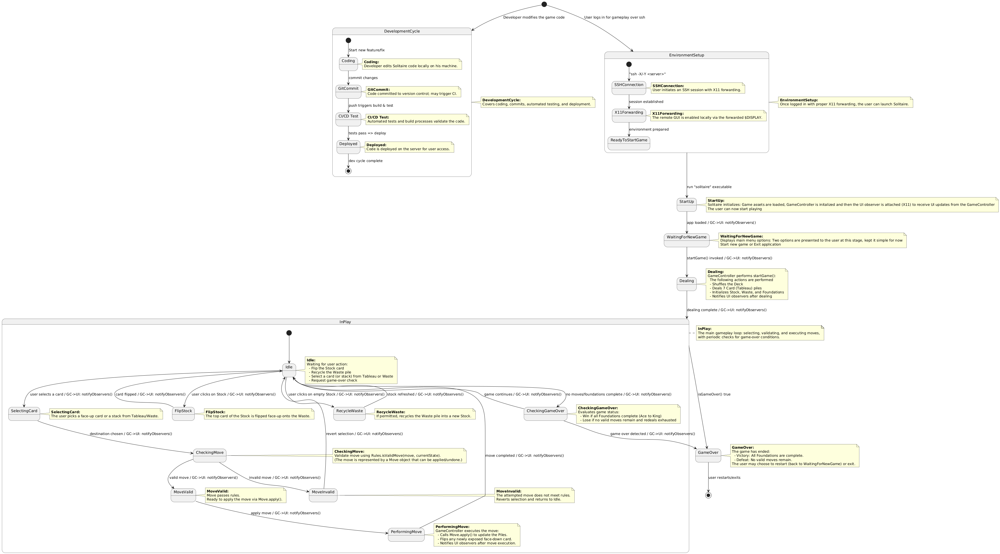
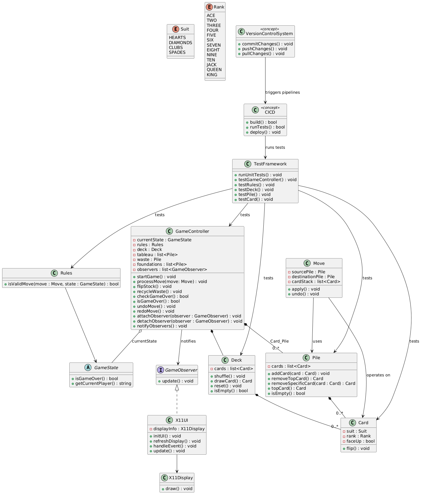
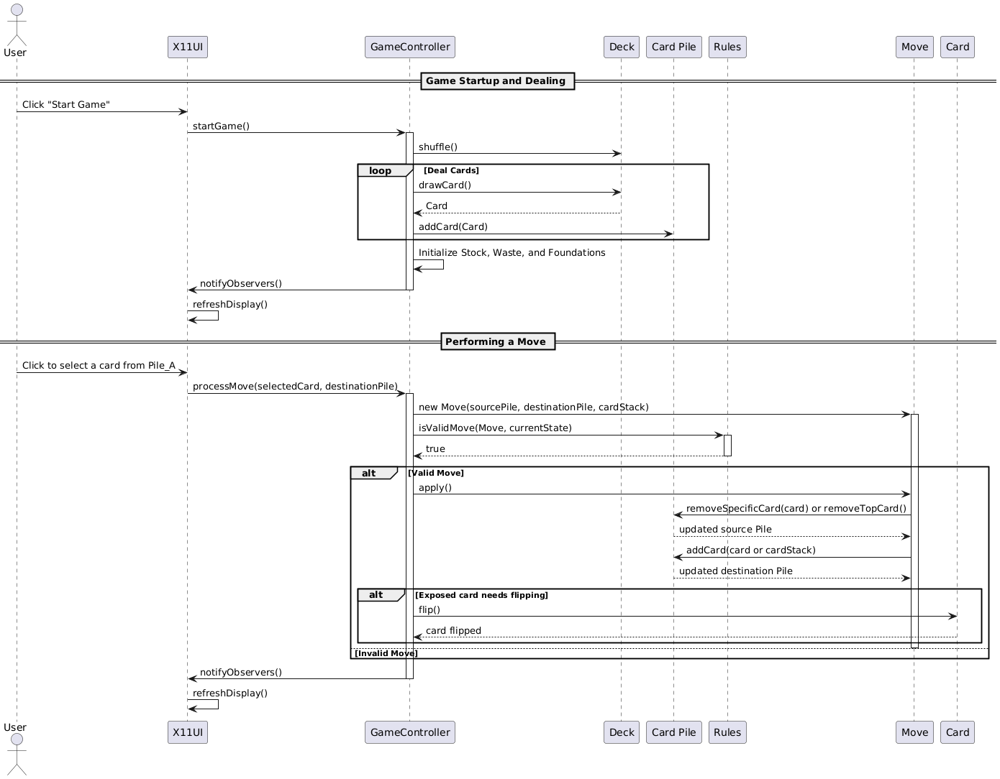

# Coding Challenge for - Hardware Abstraction Layer Transitional Library for Software to Hardware Posits For RISC-V

The task at hand was to generate UML documentation for Solitaire Gameplay.

I have generated the state, sequence and class diagrams using plantUML, which have been named accordingly and stored in plaintext files.
The diagrams from the code were generated using [PlantUML](https://plantuml.com/)

Images below for reference

<h3>State Diagram </h3> 

<h3> Class Diagram </h3> 

<h3> Sequence Diagram </h3>

